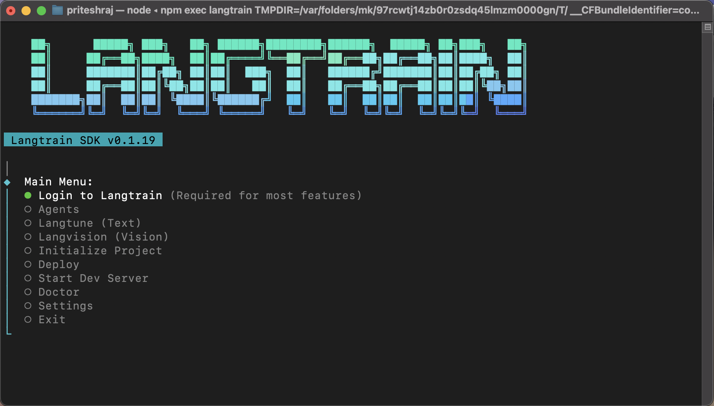

<div align="center">
  <br />
  <picture>
    <source media="(prefers-color-scheme: dark)" srcset="https://raw.githubusercontent.com/langtrain-ai/langtrain-sdk/main/public/langtrain-white.svg">
    <source media="(prefers-color-scheme: light)" srcset="https://raw.githubusercontent.com/langtrain-ai/langtrain-sdk/main/public/langtrain-black.svg">
    
  </picture>
  
  <br />
  <br />

  <h1>The Unified AI Engineering Platform</h1>
  
  <p style="font-size: 1.2rem; max-width: 600px; margin: 0 auto; color: #666;">
    Build, fine-tune, and deploy autonomous agents with a single workflow.
    <br />
    Langtrain bridges the gap between local development and enterprise-grade cloud infrastructure.
  </p>

  <br />

  <p>
    <a href="https://www.npmjs.com/package/langtrain"></a>
    <a href="https://www.npmjs.com/package/langtrain"></a>
    <a href="https://langtrain.xyz"></a>
    <a href="https://docs.langtrain.xyz"></a>
    <a href="https://github.com/langtrain-ai/langtrain-sdk/blob/main/LICENSE"></a>
  </p>

  <br />

  <a href="https://langtrain.xyz">
    
  </a>

</div>

<br />
<br />

## Quick Start

Get up and running in seconds. Langtrain CLI is your gateway to the entire ecosystem.

```bash
# Install globally
npm install -g langtrain

# Start the interactive studio
lt
```

<details>
<summary><strong>Troubleshooting Installation</strong></summary>

If you encounter permission errors, try running with sudo or check your npm permissions:
```bash
sudo npm install -g langtrain
```
</details>

<br />

## Features

Langtrain provides a complete toolkit for the modern AI engineer.

| Feature | Description |
| :--- | :--- |
| **Autonomous Agents** | Create, manage, and chat with custom agents. Routable via `lt agent`. |
| **Langtune** | Fine-tune LLMs (Llama 3, Mistral) locally using QLoRA or dispatch to H100s. |
| **Langvision** | Optimize multimodal datasets and vision models for edge deployment. |
| **Enterprise Security** | Local-first architecture. Your data leaves your machine only when you say so. |
| **Instant Deploy** | Push your verified agents to production endpoints with `lt deploy`. |

<br />

## SDK Integration

Use the power of Langtrain directly in your Node.js or TypeScript applications.

```typescript
import { Langvision, Langtune } from 'langtrain';

// Initialize with your project context
const vision = new Langvision({ apiKey: process.env.LANGTRAIN_API_KEY });
const tune = new Langtune({ apiKey: process.env.LANGTRAIN_API_KEY });

async function main() {
  // 1. Analyze Visual Context
  const analysis = await vision.analyze({
    image: './dashboard.png',
    prompt: 'Extract UI component hierarchy'
  });

  // 2. Generate Optimized Code
  const code = await tune.generate({
    model: 'gpt-4-turbo',
    prompt: `Create a React component based on: ${analysis.description}`
  });
  
  console.log(code);
}
```

<br />

## Configuration

Configure your environment seamlessly via CLI or environment variables.

| Variable | Description |
| :--- | :--- |
| `LANGTRAIN_API_KEY` | Your project Secret Key (find it in Settings). |
| `LANGTRAIN_WORKSPACE_ID` | (Optional) Target specific workspace environments. |

> **Pro Tip:** Run `lt login` to authenticate continuously without managing `.env` files manually.

<br />

##  Community & Support

Join the thousands of engineers building with Langtrain.

- **[Documentation](https://docs.langtrain.xyz)** - Guides, API Reference, and Tutorials.
- **[GitHub Discussions](https://github.com/langtrain-ai/langtrain-sdk/discussions)** - Ask questions, request features.
- **[Enterprise Support](mailto:support@langtrain.xyz)** - Dedicated support for teams.

<br />

---

<div align="center">
  <p style="color: #666; font-size: 0.9rem;">
    © 2024 Langtrain AI Inc. All rights reserved. <br />
    <a href="https://langtrain.xyz/privacy">Privacy Policy</a> • <a href="https://langtrain.xyz/terms">Terms of Service</a>
  </p>
</div>
