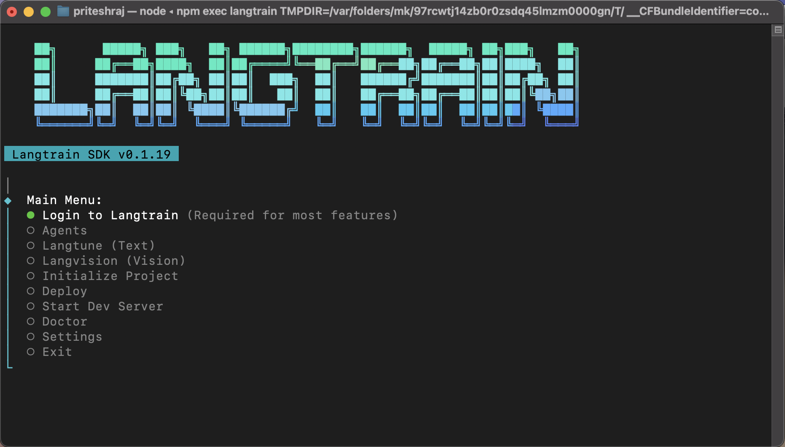

<div align="center">
  <br />
  <picture>
    <source media="(prefers-color-scheme: dark)" srcset="https://raw.githubusercontent.com/langtrain-ai/langtrain_sdk/main/public/langtrain-white.svg">
    <source media="(prefers-color-scheme: light)" srcset="https://raw.githubusercontent.com/langtrain-ai/langtrain_sdk/main/public/langtrain-black.svg">
    
  </picture>
  
  <br />
  <br />

  <h1>The Unified AI Engineering Platform & CLI</h1>
  
  <p style="font-size: 1.2rem; max-width: 600px; margin: 0 auto; color: #a1a1aa;">
    Build, fine-tune, align, and deploy autonomous agents with a single workflow.
    <br />
    Bridges local development (Ollama / LM Studio / Apple Silicon) and enterprise cloud GPUs.
  </p>

  <br />

  <p>
    <a href="https://www.npmjs.com/package/langtrain"></a>
    <a href="https://www.npmjs.com/package/langtrain"></a>
    <a href="https://langtrain.xyz"></a>
    <a href="https://langtrain.xyz/docs"></a>
    <a href="https://github.com/langtrain-ai/langtrain_sdk/blob/main/LICENSE"></a>
  </p>

  <br />

  <a href="https://langtrain.xyz">
    
  </a>

</div>

<br />
<br />

## Quick Start

Install globally to get both the `langtrain` and `lt` command aliases:

```bash
# Install globally via npm
npm install -g langtrain

# Or run instantly with npx
npx langtrain
```

Authenticate with your browser in seconds:
```bash
lt login
```

Start the interactive session:
```bash
lt
```

---

## Interactive REPL & Slash Commands

When you launch `lt`, you enter a Claude Code-style interactive shell with real-time session tracking, syntax coloring, tab completions, and slash commands:

```text
  ─────────────────────────────────────────────────────────────────────────────
  ◯ Langtrain CLI                ( ) Env: cloud    ( ) Model: meta-llama-3.1
  ( ) Context: 12%               ( ) Cost: $0.012  ( ) Usage: 12,400 / 100,000 tkns
  ─────────────────────────────────────────────────────────────────────────────

❯ /help
```

### Essential Slash Commands

| Command | Usage | Description |
| :--- | :--- | :--- |
| `/train` | `/train --file data.jsonl --rank 16` | Launch fine-tuning with dataset intelligence |
| `/chat` | `/chat [modelId]` | Interactive terminal chat with fine-tuned models |
| `/status` | `/status [jobId]` | Inspect active or specific job training metrics |
| `/watch` | `/watch [jobId]` | Live stream training loss and epoch progress |
| `/jobs` | `/jobs [--limit 10]` | List all recent cloud and local training runs |
| `/models` | `/models` | Browse available base models and fine-tuned checkpoints |
| `/upload` | `/upload <file>` | Ingest dataset (JSONL, CSV, Parquet) with session caching |
| `/analyze` | `/analyze <file>` | Run dataset intelligence (task detection, health score) |
| `/align` | `/align --method dpo --file prefs.jsonl` | Run alignment training (DPO, GRPO, PPO, ORPO, KTO) |
| `/gpu` | `/gpu` | Check available cloud GPU clusters (H100, A100, L40S) |

---

## Standalone CLI Commands

All core operations can also be run directly from scripts, CI/CD pipelines, or terminal commands without entering the interactive REPL:

```bash
# Diagnostics & Health Check
lt doctor

# Authentication
lt login
lt logout
lt status       # Check current subscription tier and quotas

# Autonomous Agents
lt agent list
lt agent create
lt agent delete

# Model Fine-Tuning (Langtune)
lt tune list
lt tune train
lt tune generate

# Multimodal & Vision (Langvision)
lt vision train
lt vision generate

# Dataset Management
lt data list
lt data upload <path/to/dataset.jsonl>
lt data refine <fileId>

# Cloud Deployment & Dev
lt deploy
lt dev
lt logs [agentId]
lt env
lt tokens
lt telemetry
```

---

## TypeScript / Node.js SDK

Import and use Langtrain programmatically in your applications:

```typescript
import { Langtrain, Langtune, Langvision } from 'langtrain';

// Initialize the master client
const lt = new Langtrain({
  apiKey: process.env.LANGTRAIN_API_KEY,
  // baseUrl: 'http://localhost:8000' // Optional local override
});

async function main() {
  // 1. Ingest dataset
  const file = await lt.files.upload('./train.jsonl', 'workspace-id', 'fine-tune');
  console.log(`Uploaded dataset: ${file.id}`);

  // 2. Launch training job
  const job = await lt.training.createJob({
    name: 'support-agent-v1',
    base_model: 'meta-llama/Llama-3.1-8B-Instruct',
    dataset_id: file.id,
    training_method: 'adaptive_rank',
    hyperparameters: {
      n_epochs: 3,
      lora_rank: 16,
    },
  });
  console.log(`Job launched: ${job.id}`);

  // 3. Multimodal Analysis via Langvision
  const analysis = await lt.vision.analyze({
    image: './screenshot.png',
    prompt: 'Extract structured form fields',
  });
  console.log(analysis);
}

main().catch(console.error);
```

---

## Configuration & Environment Variables

| Variable | Description | Default |
| :--- | :--- | :--- |
| `LANGTRAIN_API_KEY` | API secret key (managed automatically by `lt login`) | `~/.langtrain/config.json` |
| `LANGTRAIN_BASE_URL` | Base API target URL | `https://api.langtrain.xyz` |
| `LANGTRAIN_AUTH_URL` | Authentication service endpoint | `https://auth.langtrain.xyz` |
| `LANGTRAIN_MODEL` | Default fallback model identifier | `meta-llama-3.1` |

---

## Community & Support

- 🌐 [Official Website](https://langtrain.xyz)
- 📖 [Documentation](https://langtrain.xyz/docs)
- 💬 [Discord Community](https://discord.gg/langtrain)
- 📦 [npm Package](https://www.npmjs.com/package/langtrain)

---

<div align="center">
  <p style="color: #666; font-size: 0.9rem;">
    © 2026 Langtrain AI Inc. All rights reserved. <br />
    <a href="https://langtrain.xyz/privacy">Privacy Policy</a> • <a href="https://langtrain.xyz/terms">Terms of Service</a>
  </p>
</div>
